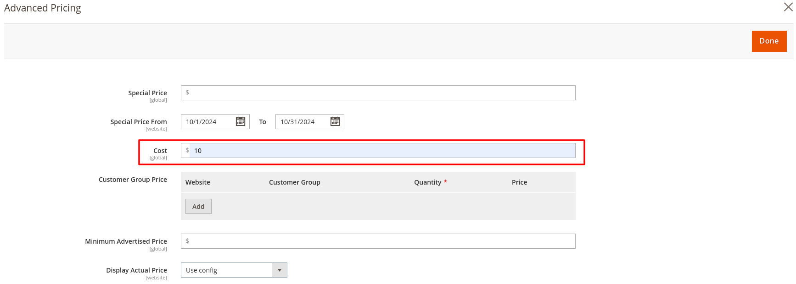

# Magento 2 Estimated Profit Module
The mavenbird/module-estimated-profit module for help businesses forecast and analyze their profitability. This module provides users with insights into potential profits based on various parameters, enabling informed decision-making for pricing, cost management, and sales strategies.

## Key Features:
- **Real-Time Profit Calculation:**
Automatically calculates estimated profits based on live sales data, costs, and pricing, providing up-to-date financial insights.
- **Customizable Parameters:**
Allows users to input and modify various parameters such as product costs, sales prices, and operational expenses for tailored profit estimates.
- **Scenario Analysis:**
Facilitates "what-if" analyses to help users explore different pricing strategies and cost structures, understanding their impact on profitability.
- **Detailed Reporting:**
Generates comprehensive reports detailing estimated profits by product, category, or time frame, enabling data-driven decision-making.
- **Visual Analytics:**
Offers visual representations of profit estimates through charts and graphs, making it easier to identify trends and communicate insights.

## Benefits:
- **Informed Decision-Making:** 
Provides accurate profit estimates that enable businesses to make data-driven decisions regarding pricing, budgeting, and resource allocation.
- **Enhanced Financial Planning:**
Supports effective financial planning by allowing users to forecast potential profits and understand the financial implications of different strategies.
- **Increased Profitability:**
Helps identify profitable products and services, enabling businesses to focus their efforts on maximizing returns and improving overall profitability.
- **Cost Management:**
Facilitates better cost control by allowing users to analyze expenses against revenue, helping identify areas where costs can be reduced or optimized.
- **Competitive Advantage:**
Equips businesses with insights into their profitability, enabling them to adjust strategies quickly and gain a competitive edge in the market.

## Compatibility:
This extension is compatible with Magento 2.4.X (PHP - 8.1 - 8.3) version.

## Installation:
*Install via composer (recommend)* - 

Easy installation process with step-by-step instructions provided for hassle-free setup.
~~~~~~~~~~~~~~~~~~~~~
php bin/magento module:enable mavenbird/module-estimatedprofit
php bin/magento setup:upgrade
php bin/magento setup:di:compile
php bin/magento setup:static-content:deploy
php bin/magento cache:flush
Manual Installation:
Download the latest release from GitHub releases.
~~~~~~~~~~~~~~~~~~~~~

## Upgrade/Update Module:
Run the following command in Magento 2 root folder for easy update -
~~~~~~~~~~~~~~~~~~~~~
php bin/magento module:enable mavenbird/module-estimatedprofit
php bin/magento setup:upgrade
php bin/magento setup:di:compile
php bin/magento setup:static-content:deploy
php bin/magento cache:flush
~~~~~~~~~~~~~~~~~~~~~

## Customization Options:

## Support:
Dedicated support team available to assist with installation, customization, and any other queries or concerns.
*[support@mavenbird.com](mailto:support@mavenbird.com)* 

## Get Started:
Enhance your Magento 2 store's profitability analysis with the mavenbird/module-estimated-profit module. Simplify profit calculations, gain valuable insights, and make data-driven decisions to boost your business's financial performance today!

*Thank you!*
