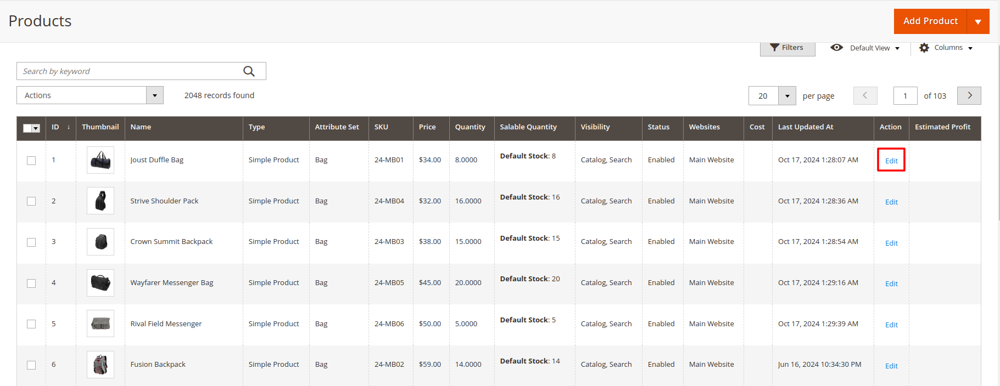

# Magento 2 Estimate Profit Extension

Boost your Magento 2 store with the Estimated Profit Extension. This powerful extension allows store owners to calculate and track estimated profits seamlessly, helping in better business decisions and financial analysis.

## Key Features:

- **Calculate Estimated Profit:**
Store owners can calculate estimated profits for each product based on cost and selling price.
- **Bulk Profit Calculation:**
Easily update and calculate profit margins for multiple products at once.
- **Profit Reports:**
Generate detailed profit reports for better financial insights.
- **Cost Price Management:**
Set and manage cost prices for products efficiently.
- **Order Profit Calculation:**
Calculate profit per order based on product costs and selling prices.
- **Graphical Profit Analysis:**
View profit trends and analysis using charts and graphs.
- **Multi-Store Support:**
Works seamlessly with multiple store views.
- **Hyvä Theme Compatibility:**
Fully compatible with the Hyvä theme for a modern and optimized experience.

## Benefits:

- **Accurate Profit Tracking:**
Get a clear view of your profit margins and make informed business decisions.
- **Increase Business Revenue:**
Identify low-profit products and adjust pricing strategies accordingly.
- **Better Financial Planning:**
Analyze profit trends and plan for business growth.
- **Easy Setup & Configuration:**
User-friendly interface with simple configuration options.

## Compatibility:
This extension is compatible with Magento 2.x versions, ensuring seamless integration with your existing store setup.

## Installation:
**Install via composer (recommend)** - 

Easy installation process with step-by-step instructions provided for hassle-free setup.
~~~~~~~~~~~~~~~~~~~~~
composer require mavenbird/module-estimate-profit
php bin/magento setup:upgrade
php bin/magento setup:static-content:deploy
php bin/magento setup:di:compile
php bin/magento cache:flush
~~~~~~~~~~~~~~~~~~~~~

## Upgrade/Update Module:
Run the following command in Magento 2 root folder for easy update -
~~~~~~~~~~~~~~~~~~~~~
composer update mavenbird/module-estimate-profit
php bin/magento setup:upgrade
php bin/magento setup:static-content:deploy
php bin/magento setup:di:compile
php bin/magento cache:flush
~~~~~~~~~~~~~~~~~~~~~

## Customization Options:
Personalize the Estimated Profit features to align with your store's theme and requirements. This extension comes with user-friendly configuration options and flexible styling controls.

**Configure at Your Ease**

## Support:
Dedicated support team available to assist with installation, customization, and any other queries or concerns.
**[support@mavenbird.com](mailto:support@mavenbird.com)** 

## Get Started:
Transform your Magento 2 store with the Estimated Profit Extension today. Gain insights into your profits, optimize pricing strategies, and make informed business decisions.

**Thank you!**
